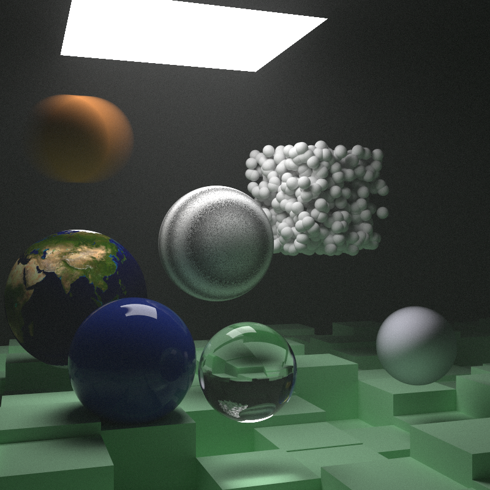
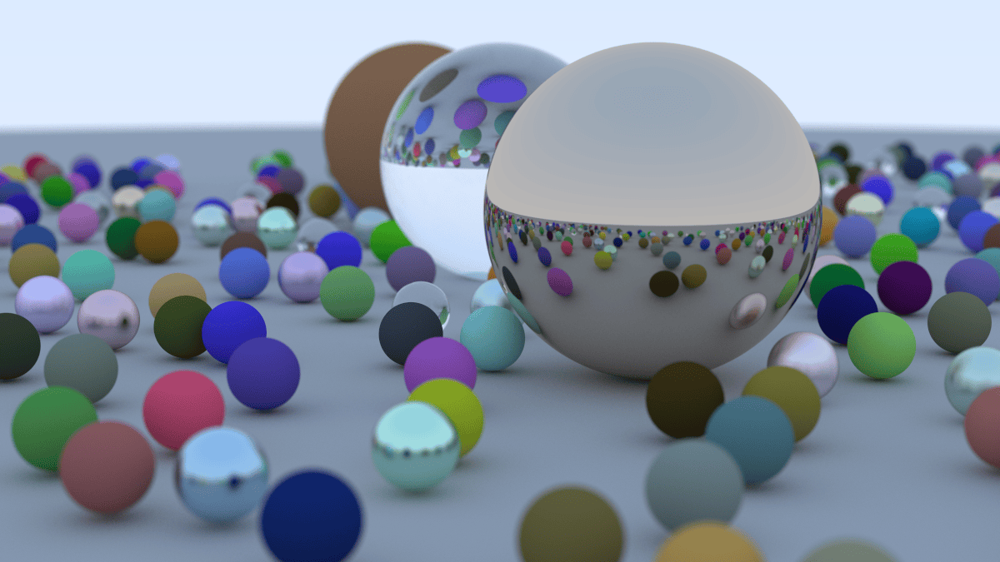
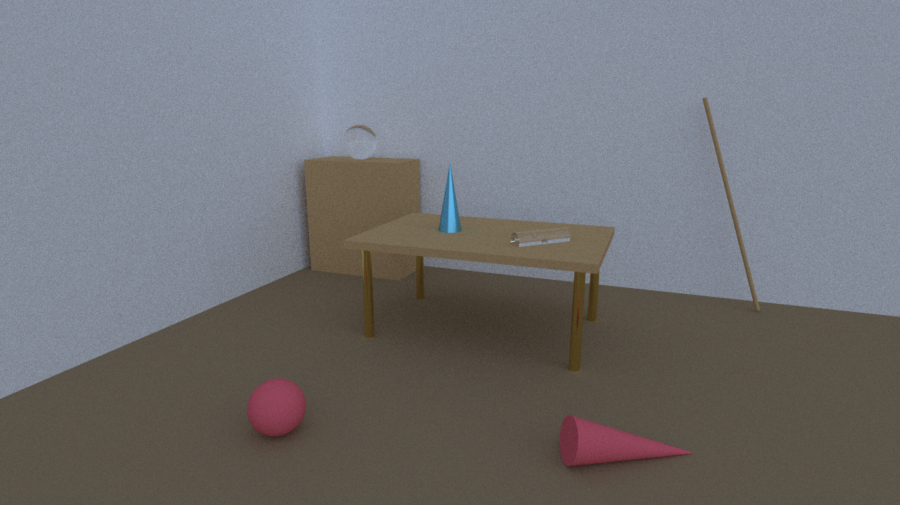
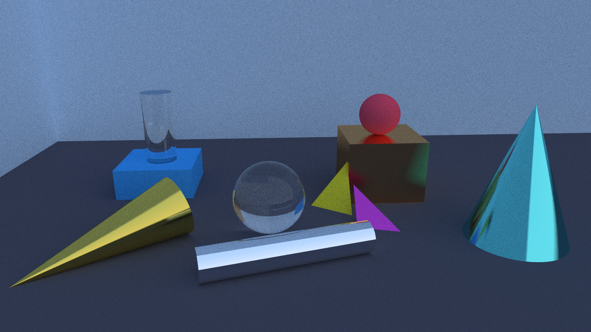
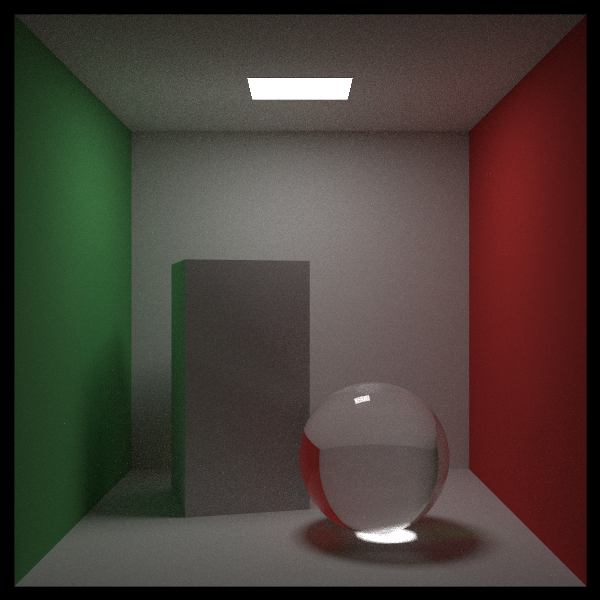
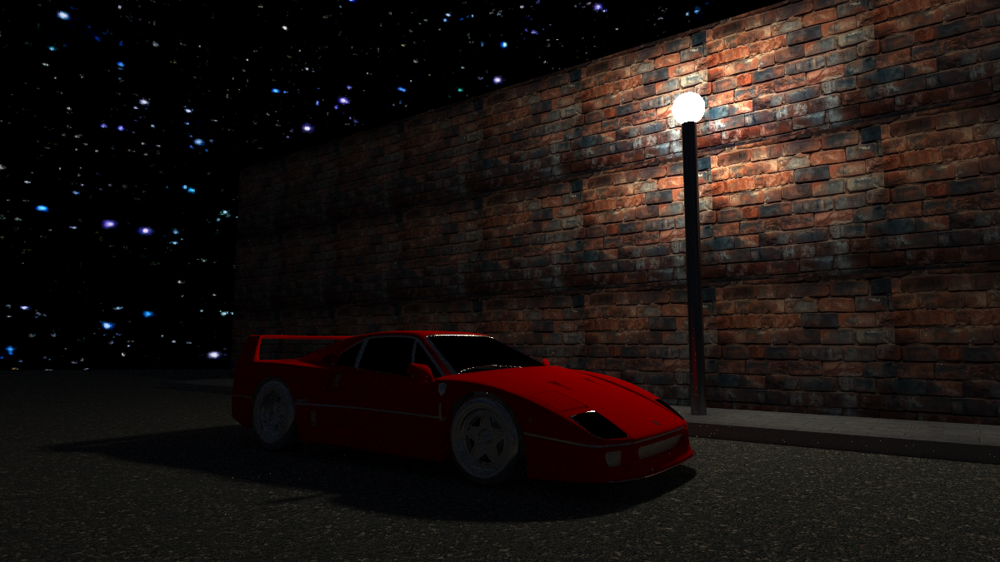

# Path Tracer C++ Implementation




This repository contains your path tracer implementation in two versions:

1. `RayTracing`: CPU implementation following [Ray Tracing in One Weekend](https://raytracing.github.io/).
2. `VulkanGPURT`: GPU implementation using a Vulkan compute shader (headless, no window/swapchain), writing the final image to a `.ppm` file.

Both versions render the same style of path-traced scenes and produce image output files.

## Hardcoded scenes results

- `weekend.png`: Render of the "weekend" scene with a variety of spheres and materials.

- `room_interior.png`: Render of the "room interior" scene with a Cornell box setup and a light source.

- `abstract_life.png`: Render of the "abstract life" scene with a more artistic arrangement of objects and materials.

- `cornell_box.png`: Render of the classic Cornell box scene with a box and a sphere.

- `ferrari.png`: Render of a Ferrari 1987 model in a scene with a simple background and lighting.


## Build And Run (CPU)

Project folder: `RayTracing`

Build:

```bash
cmake -S RayTracing -B RayTracing/build
cmake --build RayTracing/build --config Release
```

Binary output:

- `RayTracing/build/out/<config>/main` or `main.exe` depending on platform and generator

The CMake build also produces the small demo executables from `RayTracing/src/`:

- `cos_cubed`
- `cos_density`
- `estimate_halfway`
- `importance_sphere`
- `integrate_x_sq`
- `pi`
- `sphere_plot`

Run (the CPU app has a small CLI — pass `--help` to see it):

```bash
# default scene (cornell_box) at the default settings
.\RayTracing\build\out\Release\main.exe

# pick a built-in scene by its file name in include/scenes/, at a quick preview size
.\RayTracing\build\out\Release\main.exe --scene ferrari_1987 --width 1200 --spp 1000 --depth 100


# render a single mesh file (path tried as-given, then relative to models/)
.\RayTracing\build\out\Release\main.exe --mesh 1987_ferrari_f40/scene.gltf
```

Options:

- `--scene <name>`: built-in scene, selected by its exact file name (default `cornell_box`). Run with `--help` for the full list.
- `--mesh <path>`: render one `.obj`/`.gltf`/`.glb`; overrides `--scene`. The path is resolved relative to the working directory (or absolute), then relative to the `models/` folder.
- `--width N`, `--spp N`, `--depth N`: image width, samples per pixel, and max ray bounces.
- `-h`, `--help`: print usage and the list of scenes.

The build mirrors the `models/` and `images/` asset folders next to the executable, so assets load regardless of the working directory.

Output image:

- `RayTracing/build/out/<config>/image.ppm`

Mesh import support is available through header-only loaders in `RayTracing/include/external/`:

- `tiny_obj_loader.h` for OBJ files
- `cgltf.h` for glTF 2.0 files

The reusable scene helper is `mesh_scene(...)` in `RayTracing/include/scenes/mesh.h`, invoked with `main --mesh <path>`. It detects `.obj`, `.gltf`, or `.glb`, builds a triangle BVH from the imported faces, and auto-frames the camera. Built-in scenes are selected by file name, e.g. `main --scene ferrari_1987` (add `--width/--spp/--depth` for quick previews).

## Build And Run (Vulkan GPU)

Project folder: `VulkanGPURT`

Requires the Vulkan SDK installed and the `VULKAN_SDK` environment variable set (CMake uses it to find `glslc` for compiling the compute shader).

Build (run from the repository root):

```bash
cmake -S VulkanGPURT -B VulkanGPURT/build
cmake --build VulkanGPURT/build --config Release
```

Binary output:

- `VulkanGPURT/build/<config>/vulkan_gpu_rt.exe` (e.g. `VulkanGPURT/build/Release/vulkan_gpu_rt.exe`)

Shader output compiled and copied next to the executable by the build:

- `VulkanGPURT/build/<config>/shaders/path_tracer.comp.spv`

Run example (launch from the repository root so the shader is found):

```bat
.\VulkanGPURT\build\Release\vulkan_gpu_rt.exe --width 1200 --height 675 --spp 20 --bounces 10 --scene weekend --output VulkanGPURT/out/image.ppm
```

The renderer locates `path_tracer.comp.spv` relative to the current working directory, checking `VulkanGPURT/build/Release/shaders/` and `VulkanGPURT/build/Debug/shaders/`. Run it from the repository root (as shown above); if you run it from elsewhere, pass a working directory at the repo root or place a `shaders/path_tracer.comp.spv` alongside where you launch it.

Supported arguments:

- `--width <int>`
- `--height <int>`
- `--aspect <float>`
- `--spp <int>`
- `--bounces <int>`
- `--seed <int>`
- `--scene <weekend|two-sphere>`
- `--output <path>`

Default render configuration:

- `width=1200`, `height=675`, `aspect=16:9`
- `spp=20`, `max_bounces=10`, `seed=1`
- `scene=weekend`
- `output=render.ppm`
