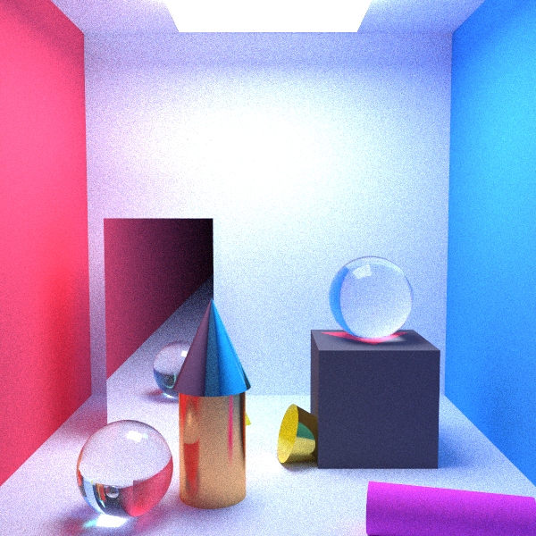

# Path Tracer C++ Implementation


This repository contains your path tracer implementation in two versions:

1. `RayTracing`: CPU implementation following [Ray Tracing in One Weekend](https://raytracing.github.io/).
2. `VulkanGPURT`: GPU implementation using a Vulkan compute shader (headless, no window/swapchain), writing the final image to a `.ppm` file.

Both versions render the same style of path-traced scenes and produce image output files.

## Hardcoded scenes results

- `weekend.png`: Render of the "weekend" scene with a variety of spheres and materials.

- `room_interior.png`: Render of the "room interior" scene with a Cornell box setup and a light source.

- `abstract_life.png`: Render of the "abstract life" scene with a more artistic arrangement of objects and materials.

- `cornell_box.png`: Render of the classic Cornell box scene with two boxes.


## Build And Run (CPU)

Project folder: `RayTracing`

Build:

```bat
cd RayTracing
build.bat
```

Binary output:

- `RayTracing/out/main.exe`

Run:

```bat
RayTracing\out\main.exe
```

Output image:

- `RayTracing/out/image.ppm`

The CPU app builds the weekend scene with diffuse/metal/dielectric materials and renders it with the configured camera and sampling settings.

## Build And Run (Vulkan GPU)

Project folder: `VulkanGPURT`

Build:

```bat
cd VulkanGPURT
build.bat
```

Binary output:

- `VulkanGPURT/out/vulkan_gpu_rt.exe`

Shader output copied by the build script:

- `VulkanGPURT/out/shaders/path_tracer.comp.spv`

Run example:

```bat
VulkanGPURT\out\vulkan_gpu_rt.exe --width 1200 --height 675 --spp 20 --bounces 10 --scene weekend --output image.ppm
```

Supported arguments:

- `--width <int>`
- `--height <int>`
- `--aspect <float>`
- `--spp <int>`
- `--bounces <int>`
- `--seed <int>`
- `--scene <weekend|two-sphere>`
- `--output <path>`

Default render configuration:

- `width=1200`, `height=675`, `aspect=16:9`
- `spp=20`, `max_bounces=10`, `seed=1`
- `scene=weekend`
- `output=render.ppm`
